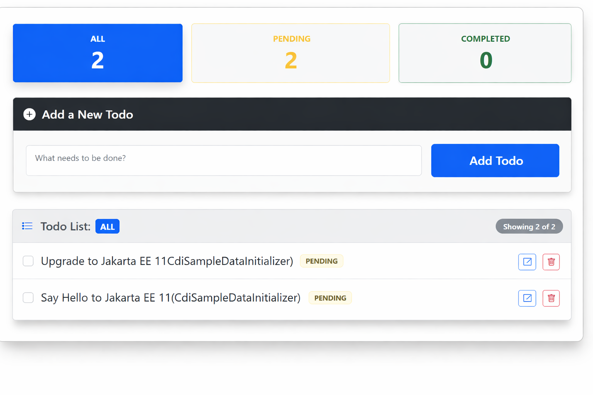

# Jakarta EE 11 Starter Boilerplate

[](https://github.com/hantsy/jakartaee11-starter-boilerplate/actions/workflows/build.yml)
[](https://github.com/hantsy/jakartaee11-starter-boilerplate/actions/workflows/arq-glassfish-managed.yml)
[](https://github.com/hantsy/jakartaee11-starter-boilerplate/actions/workflows/arq-payara-managed.yml)
[](https://github.com/hantsy/jakartaee11-starter-boilerplate/actions/workflows/arq-wildfly-managed.yml)
[](https://github.com/hantsy/jakartaee11-starter-boilerplate/actions/workflows/arq-liberty-managed.yml)

A clean starter template for Jakarta EE 11 applications with ready-made integration examples for multiple Jakarta EE containers. This repository demonstrates modern Jakarta EE development with container-specific support and [Arquillian](https://arquillain.org) integration tests.



## Prerequisites

* **Java 21**
* **Maven 3.9+** (Maven 4 is recommended)

## Technical Compatibility & Issues

* **Payara (Jakarta REST)**: Serialization of Java 8 DateTime types fails because the Jackson v2 stack does not include the required `jackson-datatype-jsr310` module. Additional testing also revealed regressions in data handling.

* **WildFly 40.0.0.Final**: Hibernate Jakarta Data no longer includes initial support for derived query-by-method-name in this release. See <https://github.com/hantsy/jakartaee11-starter-boilerplate/pull/151> for details.

* <del>**OpenLiberty 26.0.0.5-beta**: While all test cases pass in isolation, the runtime fails to resolve Jakarta Data repository interfaces during application startup. A fix is reportedly available in nightly builds; verification is pending.</del> Verified: OpenLiberty 26.0.0.6-beta works as expected.

* **Embedded GlassFish**: Startup failed because of a known Jakarta Messaging issue. See <https://github.com/eclipse-ee4j/glassfish/issues/24842>.

## Build and Run

Use Maven profiles to build and launch the application on different servers:

* **GlassFish** via [Cargo Maven Plugin](https://codehaus-cargo.github.io/cargo/GlassFish+8.x.html):

  ```bash
  mvn clean package cargo:run -Pglassfish
  ```

* **Embedded GlassFish** via [Embedded GlassFish Maven Plugin](https://github.com/eclipse-ee4j/glassfish-maven-embedded-plugin):

  ```bash
  mvn clean package embedded-glassfish:run -Pglassfish-embedded
  ```

* **Payara**:

  ```bash
  mvn clean package cargo:run -Ppayara
  ```

* **Open Liberty**:

  ```bash
  mvn clean package liberty:dev -Popenliberty
  ```

* **WildFly**:

  ```bash
  mvn clean wildfly:run -Pwildfly
  ```

## Running Arquillian Tests

Arquillian integration tests are included for several managed containers. Run the matching profile for the server you want to verify:

* **GlassFish Managed**:

  ```bash
  mvn clean verify -Parq-glassfish-managed
  ```

* **Payara Managed**:

  ```bash
  mvn clean verify -Parq-payara-managed
  ```

* **WildFly Managed**:

  ```bash
  mvn clean verify -Parq-wildfly-managed
  ```

* **Open Liberty Managed**:

  ```bash
  mvn clean verify -Parq-liberty-managed
  ```
